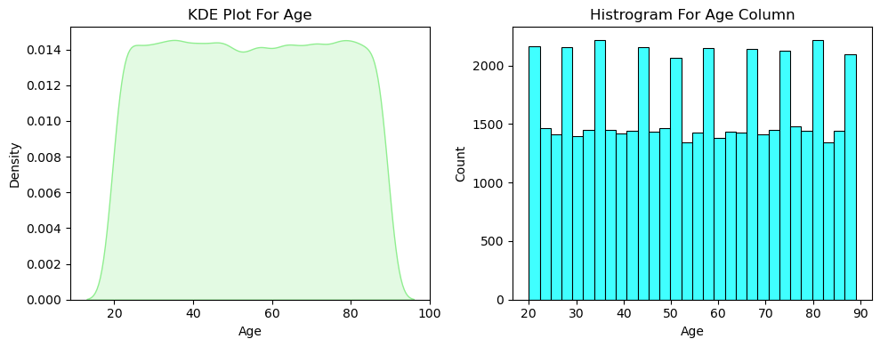

# 🧬 Cancer Data Analysis (2015–2024)
**By Pragati Kumari | Data Analyst**

---




## 📘 Project Overview
This project presents a **comprehensive data analysis of cancer patients (2015–2024)**, focusing on identifying key risk factors, lifestyle influences, and treatment outcomes.  
The study uses exploratory data analysis (EDA), statistical correlation, and machine learning (Random Forest) to understand **what influences cancer severity and survival rates**.

---

## 🎯 Objectives
- Analyze patient demographics, lifestyle, and environmental factors.  
- Examine trends in survival years and severity levels.  
- Identify which factors most influence cancer severity using ML models.  
- Visualize key findings through KDE plots, histograms, and feature importance charts.

---

## 🧩 Dataset Information
> **Note:** The dataset represents **anonymized and simulated cancer patient data (2015–2024)** curated for educational and research purposes.  
It contains 50,000 patient records with attributes such as age, gender, cancer type, stage, risk factors, and treatment cost.  

**Key Columns:**
- `Age`, `Gender`, `Country_Region`, `Cancer_Type`, `Cancer_Stage`  
- `Genetic_Risk`, `Air_Pollution`, `Alcohol_Use`, `Smoking`, `Obesity_Level`  
- `Treatment_Cost_USD`, `Survival_Years`, `Target_Severity_Score`

---

## ⚙️ Technologies Used

| Tool / Library | Purpose |
|----------------|----------|
| **Python** | Data cleaning, analysis, and modeling |
| **Pandas / NumPy** | Data preprocessing and statistical analysis |
| **Matplotlib / Seaborn** | Data visualization |
| **Scikit-learn** | Random Forest regression and evaluation |
| **Jupyter Notebook** | Interactive analysis and presentation |

---

## 🔍 Data Exploration

### 1️⃣ Age Distribution
- KDE and Histogram plots reveal a uniform age distribution from **20–90 years**.  
- Most patients are middle-aged (40–70 years).

### 2️⃣ Descriptive Statistics (Age)
| Metric | Value |
|---------|--------|
| Mean | 54.4 |
| Std Dev | 20.22 |
| Min | 20 |
| 75th Percentile | 72 |
| Max | 89 |

### 3️⃣ Key Observations
- Cancer cases are evenly distributed across age groups.  
- Majority of patients belong to the **45–75** age range, indicating higher vulnerability in mid-to-senior populations.

---

## 📈 Correlation & Statistical Insights
| Feature | Correlation (Severity) | Key Insight |
|----------|------------------------|--------------|
| Smoking | 0.48 | Highest positive impact on severity |
| Genetic_Risk | 0.47 | Strong hereditary influence |
| Air_Pollution | 0.36 | Moderate environmental impact |
| Alcohol_Use | 0.36 | Noticeable lifestyle factor |
| Obesity_Level | 0.25 | Low correlation |
| Age | ≈ 0.00 | Minimal direct effect |

✅ **Inference:**  
Smoking, genetic predisposition, and pollution show the strongest link to higher cancer severity, suggesting lifestyle and environment are critical contributors.

---

## 🤖 Machine Learning – Random Forest Model

**Model:** RandomForestRegressor  
**Target Variable:** `Target_Severity_Score`

| Metric | Score |
|---------|--------|
| **Train R²** | 0.97 |
| **Test R²** | 0.77 |

### 📊 Top Predictors of Severity
| Feature | Importance | Interpretation |
|----------|-------------|----------------|
| Smoking | 0.23 | Most influential on severity |
| Genetic_Risk | 0.22 | Almost equally impactful |
| Treatment_Cost_USD | 0.21 | Higher costs correlate with higher severity |
| Alcohol_Use | 0.13 | Moderate impact |
| Air_Pollution | 0.12 | Environmental effect |
| Obesity_Level | 0.05 | Minor influence |
| Age / Gender | <0.01 | Minimal effect |

✅ **Conclusion:**  
The model performed well, capturing most variance in severity with limited overfitting.  
Top drivers of cancer severity are **Smoking**, **Genetic Risk**, and **Environmental Factors**.

---

## 🎨 Visuals Included
- KDE Plot & Histogram (Age Distribution)  
- Correlation Heatmap  
- Feature Importance Bar Chart  
- Model Evaluation Metrics Summary

---

## 🧠 Insights & Recommendations
- Lifestyle factors (smoking, alcohol) and pollution levels are key drivers of cancer severity.  
- Strong genetic influence suggests value in early screening for high-risk individuals.  
- Better awareness programs and air-quality interventions could reduce severity trends.  
- Predictive models like Random Forest can assist in **severity prediction and cost optimization**.


## ⚙️ Technologies Used

| Category | Tools / Libraries |
|:--|:--|
| Language | Python |
| Data Analysis | Pandas, NumPy |
| Visualization | Matplotlib, Seaborn |
| Machine Learning | Scikit-learn |
| Optional Interpretability | SHAP |
| Notebook Environment | Jupyter Notebook / Google Colab |

---

## 🧠 Results Summary

- **Model Accuracy:** R² (Test) = **0.77**  
- **Primary Drivers:** Smoking, Genetic Risk, Air Pollution  
- **Error Range:** MAE ≈ 0.46 (low deviation)  
- **Conclusion:** Machine learning enables reliable prediction of cancer severity, supporting data-driven healthcare policy decisions.

---

## 🏁 Conclusion

This project demonstrates how **data analytics and machine learning** can reveal key patterns in public health data.  
By identifying high-risk factors, healthcare providers can prioritize **preventive action, early diagnosis, and resource allocation**, ultimately improving patient survival outcomes.

---

---

## 🚀 How to Run
```bash
# Clone this repository
git clone https://github.com/Pragati928/Cancer-data-Analysis.git

# Navigate into project folder
cd Cancer-Data-Analysis

# Open the notebook
jupyter notebook "Cancer data Analysis New.ipynb"

---